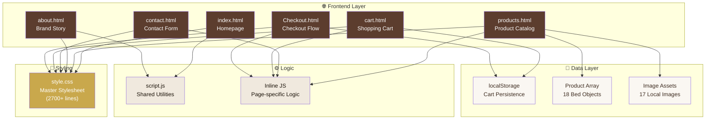
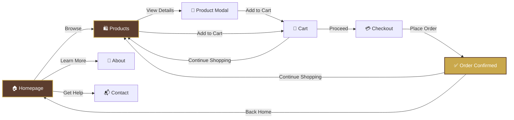
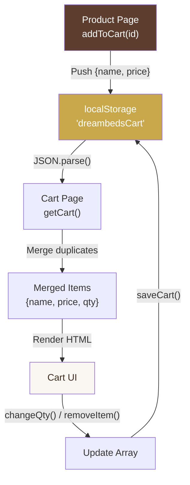
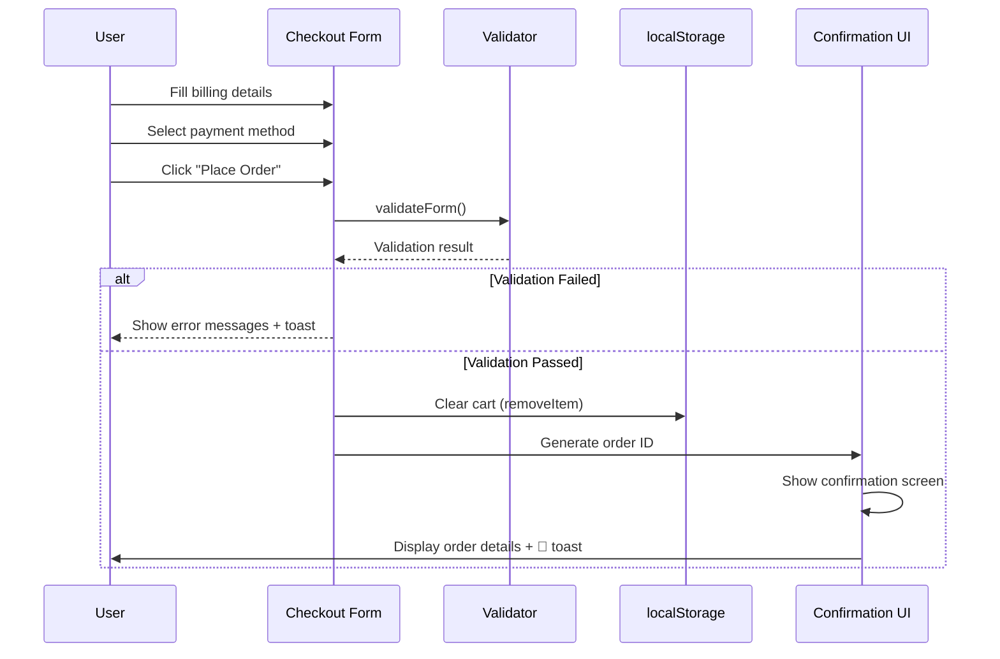
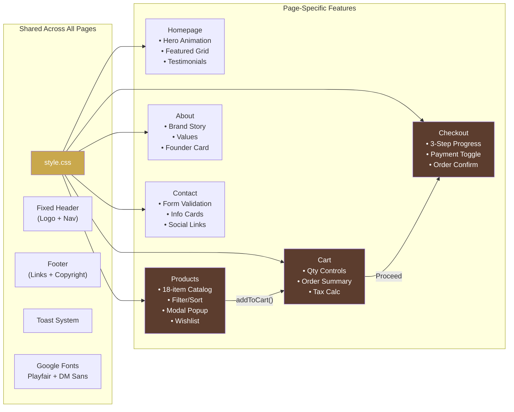
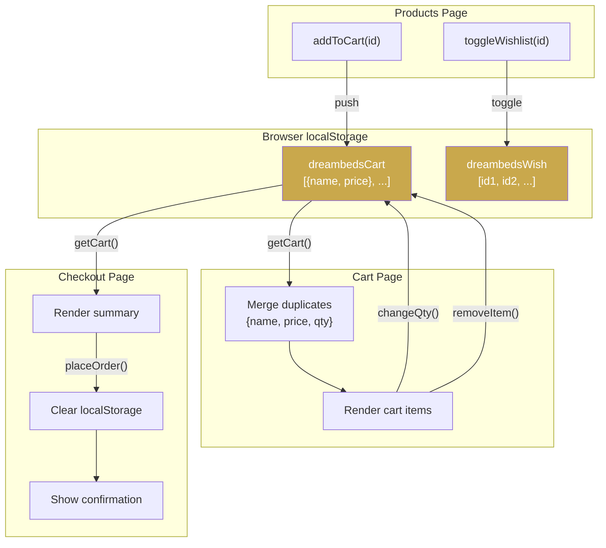

<p align="center">
  
</p>

<h1 align="center">🛏️ DreamBeds — Luxury Bed E-Commerce Portal</h1>

<p align="center">
  <em>A premium, fully-functional luxury bed e-commerce website built with pure HTML, CSS & JavaScript.</em>
</p>

<p align="center">
  
  
  
  
  
  
</p>

---

## 📌 Project Description

> **DreamBeds is built by Puri AI — dominating old-school web development and leading the rise of AI. Where devs once spent weeks hand-coding layouts and fixing cross-browser bugs, Puri AI ships production-grade e-commerce sites in minutes. This project marks the shift from traditional coding to intelligent AI-driven design, crafting stunning luxury UX fast.**

---

## 🚀 About This Project

**DreamBeds** is an end-to-end luxury bed e-commerce portal designed for a premium shopping experience. The project simulates a real-world online furniture store with a complete user journey — from browsing products and reading about the brand, to managing a shopping cart and completing a secure checkout.

### What Makes It Special?

- 🎨 **Premium Aesthetic** — Warm cream tones, gold accents, serif typography (Playfair Display), and smooth animations create a high-end luxury feel
- 🛒 **Full Cart System** — Persistent cart using `localStorage`, with quantity management, tax calculation, and order summary
- 🔍 **Smart Product Filtering** — Filter by category (King, Queen, Modern, Wooden) and sort by price
- 📱 **Fully Responsive** — Every page adapts beautifully from desktop to mobile
- ⚡ **Zero Dependencies** — No frameworks, no build tools — pure vanilla HTML/CSS/JS
- 🎭 **Micro-Animations** — Scroll reveals, floating cards, hover effects, and toast notifications

---

## 🗂️ Project Structure

```
sessional/
│
├── 📄 index.html          → Homepage (hero, featured beds, testimonials)
├── 📄 products.html        → Product catalog (18 beds, filters, sort, modals)
├── 📄 about.html           → Brand story, values, founder profile
├── 📄 contact.html         → Contact form with validation
├── 📄 cart.html             → Shopping cart with quantity controls
├── 📄 Checkout.html         → 3-step checkout with payment options
│
├── 🎨 style.css            → Master stylesheet (2700+ lines, all pages)
├── ⚙️ script.js            → Shared JavaScript (cart, toast, scroll reveal)
│
├── 🖼️ Royal.png            → Royal King Upholstered Bed
├── 🖼️ ModernMinamilist.png → Modern Minimalist Platform Bed
├── 🖼️ SolidSheesham.png    → Solid Sheesham Carved Bed
├── 🖼️ Velevet.jpg          → Luxe Velvet Wingback Bed
├── 🖼️ FloatingLed.png      → Floating LED Panel Bed
├── 🖼️ VictoriaRoseGOld.png → Victorian Rose Gold Bed
├── 🖼️ QueesHydraulic.png   → Queen Storage Hydraulic Bed
├── 🖼️ CloudNine.png        → Cloud Nine Queen Divan
├── 🖼️ EmperorTeak.png      → Emperor Teak Poster Bed
├── 🖼️ ClestifiedLeather.png→ Chesterfield Leather Bed
├── 🖼️ Japanese.png         → Japanese Tatami Low Bed
├── 🖼️ Ivory.jpg            → Ivory Canopy Drape Bed
├── 🖼️ Rattan.png           → Rattan Cane Boho Bed
├── 🖼️ Ottoman.png          → Ottoman Storage King Bed
├── 🖼️ Antique.jpg          → Antique Brass Frame Bed
├── 🖼️ WoodPoster.jpg       → Walnut Four-Poster Bed
├── 🖼️ MangoWoord.jpg       → Rustic Mango Wood Bed
│
└── 📝 README.md            → This file
```

---

## 🏗️ Architecture Diagram



---

## 🔄 User Flow Diagram



---

## 📄 Page-by-Page Breakdown

### 1. 🏠 Homepage (`index.html`)

| Section | Description |
|---------|-------------|
| **Fixed Header** | Glassmorphism navbar with backdrop-blur, gold-accented logo, and cart button |
| **Hero Section** | Full-height split layout — text + Unsplash hero image with floating card animation |
| **Trust Bar** | Brown strip with delivery, warranty, returns, and assembly guarantees |
| **Featured Beds** | 3-column card grid with image zoom, tags, prices, and "Add to Cart" buttons |
| **Why Us** | 2-column layout with image + feature list (eco-friendly, craftsmanship, custom sizes) |
| **Testimonials** | 3-column customer review cards with star ratings |
| **Footer** | Dark-themed footer with logo, copyright, and navigation links |

**Key Features:**
- CSS-only `IntersectionObserver` scroll reveal animations
- Toast notification system for cart additions
- Floating card with infinite CSS keyframe animation
- Responsive grid that collapses to single column on mobile

---

### 2. 🛍️ Products Page (`products.html`)

| Section | Description |
|---------|-------------|
| **Hero Banner** | Full-width background image with dark overlay and centered text |
| **Filter Bar** | Category filter buttons (All, King, Queen, Modern, Wooden) + price sort dropdown |
| **Product Grid** | Dynamic 3-column grid rendered by JavaScript from a product data array |
| **Product Modal** | Slide-in detail popup with full description, material, size, rating, and actions |
| **Wishlist System** | Heart toggle saved to `localStorage`, visually reflected across re-renders |

**Product Data Model:**

```javascript
{
    id: 1,
    name: "Royal King Upholstered Bed",
    price: 42000,
    category: "king",          // Used for filtering
    tag: "Best Seller",        // Badge label on card
    desc: "Short description", // Shown on card
    longDesc: "Full details",  // Shown in modal popup
    material: "Teak + Velvet",
    size: "King (78×72 in)",
    rating: "4.9 ★",
    img: "Royal.png"           // Local image asset
}
```

**18 Products Available:**

| # | Name | Price (₹) | Category |
|---|------|-----------|----------|
| 1 | Royal King Upholstered Bed | 42,000 | King |
| 2 | Modern Minimalist Platform Bed | 18,500 | Modern |
| 3 | Solid Sheesham Carved Bed | 35,000 | Wooden |
| 4 | Luxe Velvet Wingback Bed | 48,000 | King |
| 5 | Scandinavian Oak Frame Bed | 22,000 | Modern |
| 6 | Queen Storage Hydraulic Bed | 28,000 | Queen |
| 7 | Walnut Four-Poster Bed | 55,000 | Wooden |
| 8 | Floating LED Panel Bed | 32,000 | Modern |
| 9 | Victorian Rose Gold Bed | 62,000 | King |
| 10 | Rustic Mango Wood Bed | 26,000 | Wooden |
| 11 | Cloud Nine Queen Divan | 15,000 | Queen |
| 12 | Emperor Teak Poster Bed | 72,000 | King |
| 13 | Chesterfield Leather Bed | 56,000 | King |
| 14 | Japanese Tatami Low Bed | 19,500 | Modern |
| 15 | Ivory Canopy Drape Bed | 44,000 | King |
| 16 | Rattan Cane Boho Bed | 21,000 | Modern |
| 17 | Ottoman Storage King Bed | 38,000 | King |
| 18 | Antique Brass Frame Bed | 34,000 | Queen |

---

### 3. 📖 About Page (`about.html`)

| Section | Description |
|---------|-------------|
| **About Hero** | Split layout with brand tagline and hero image with floating overlay card |
| **Trust Bar** | Shipping, trial, and warranty badges |
| **Values Section** | 3-pillar philosophy cards — Honest Materials, Adaptive Comfort, Human Service |
| **Story Section** | Brand origin story with stats (15k+ happy sleepers, 4.9/5 review score) |
| **Founder Section** | Premium card with gradient avatar, founder name, role, and quote |
| **Contact Section** | Email and phone contact cards with hover lift effects |

---

### 4. 📬 Contact Page (`contact.html`)

| Section | Description |
|---------|-------------|
| **Hero Banner** | Branded hero with "We're Listening" badge |
| **Contact Form** | Full-name, email, phone, subject, and message fields with real-time validation |
| **Info Sidebar** | Studio address, phone numbers, email addresses, and working hours |
| **Premium Footer** | Extended footer with social icons (Instagram, Facebook, Twitter, Pinterest) |

**Form Validation Rules:**

| Field | Validation |
|-------|-----------|
| Full Name | Required, non-empty |
| Email | Required, regex pattern (`^[^\s@]+@[^\s@]+\.[^\s@]+$`) |
| Phone | Required, 10+ digits after stripping spaces/hyphens |
| Subject | Required, non-empty |
| Message | Required, non-empty |

---

### 5. 🛒 Cart Page (`cart.html`)

| Section | Description |
|---------|-------------|
| **Hero Banner** | "Your Selections" themed header |
| **Cart Items List** | Each item shows image, name, price, quantity buttons (±), subtotal, and remove button |
| **Order Summary** | Sidebar with items count, subtotal, free delivery, 5% tax, and grand total |
| **Empty State** | Displayed when cart has zero items — CTA to explore collection |
| **Actions** | Clear Cart, Proceed to Checkout, Continue Shopping |

**Cart Data Flow:**



---

### 6. 💳 Checkout Page (`Checkout.html`)

| Section | Description |
|---------|-------------|
| **Progress Indicator** | 3-step visual progress bar (Cart ✓ → Checkout → Confirmed) |
| **Billing Form** | Name, email, phone, ZIP, address, city, state — all validated |
| **Payment Methods** | Radio toggle between Cash on Delivery, Credit/Debit Card, and UPI |
| **Card Fields** | Shown conditionally — card number (with formatting), expiry, CVV |
| **UPI Field** | Shown conditionally — UPI ID input |
| **Order Summary** | Sticky sidebar with item thumbnails, subtotal, tax, and grand total |
| **Order Confirmed** | Success screen with order ID, items count, total paid, and payment method |

**Checkout Flow:**



---

## 🎨 Design System

### Color Palette

| Token | Hex | Usage |
|-------|-----|-------|
| `--cream` | `#faf7f2` | Page backgrounds |
| `--warm` | `#f0e9de` | Section backgrounds (Why Us, Story) |
| `--brown` | `#5c3d2e` | Primary brand color, buttons, text |
| `--gold` | `#c9a84c` | Accents, badges, highlights, hover states |
| `--dark` | `#1a1208` | Headings, footer background |
| `--text` | `#3d2b1f` | Body text |
| `--muted` | `#8c7b6e` | Secondary text, descriptions |
| `--white` | `#ffffff` | Cards, overlays |

### Typography

| Font | Weight | Usage |
|------|--------|-------|
| **Playfair Display** (Serif) | 400, 600, 700 | Headings, prices, logo, stat numbers |
| **DM Sans** (Sans-serif) | 300, 400, 500 | Body text, buttons, labels, descriptions |

### Key UI Components

```
┌──────────────────────────────────────────────────────┐
│  HEADER (Fixed, Glassmorphism backdrop-blur)         │
│  [Logo]              [Nav Links]        [🛒 Cart]    │
├──────────────────────────────────────────────────────┤
│                                                      │
│  ┌─────────────────┐  ┌─────────────────┐            │
│  │   HERO TEXT      │  │   HERO IMAGE    │            │
│  │   Badge          │  │                 │            │
│  │   H1 Title       │  │   ┌──────────┐  │            │
│  │   Description    │  │   │Float Card│  │            │
│  │   [CTA Buttons]  │  │   └──────────┘  │            │
│  │   Stats Bar      │  │                 │            │
│  └─────────────────┘  └─────────────────┘            │
│                                                      │
│  ══════════ TRUST BAR (Brown Strip) ═══════════════  │
│                                                      │
│  ┌────────┐ ┌────────┐ ┌────────┐                    │
│  │ Card 1 │ │ Card 2 │ │ Card 3 │  FEATURED GRID    │
│  │ Image  │ │ Image  │ │ Image  │                    │
│  │ Title  │ │ Title  │ │ Title  │                    │
│  │ Price  │ │ Price  │ │ Price  │                    │
│  └────────┘ └────────┘ └────────┘                    │
│                                                      │
│  ┌──────────────────────────────────────────────┐    │
│  │              WHY US SECTION                  │    │
│  │  [Image]            [Feature List]           │    │
│  └──────────────────────────────────────────────┘    │
│                                                      │
│  ┌────────┐ ┌────────┐ ┌────────┐                    │
│  │Review 1│ │Review 2│ │Review 3│  TESTIMONIALS      │
│  │ ★★★★★  │ │ ★★★★★  │ │ ★★★★★  │                    │
│  └────────┘ └────────┘ └────────┘                    │
│                                                      │
├──────────────────────────────────────────────────────┤
│  FOOTER (Dark)                                       │
│  [Logo]      [Copyright]         [Nav Links]         │
└──────────────────────────────────────────────────────┘
```

---

## ⚙️ Technical Details

### Technologies Used

| Technology | Purpose |
|-----------|---------|
| **HTML5** | Semantic page structure, forms, and SEO meta tags |
| **CSS3** | Custom properties (variables), Grid, Flexbox, animations, media queries, glassmorphism |
| **Vanilla JavaScript** | DOM manipulation, event handling, dynamic rendering, form validation |
| **localStorage API** | Cart and wishlist persistence across page reloads |
| **Google Fonts** | Playfair Display + DM Sans typography |
| **Unsplash** | High-quality hero and fallback images (via URL) |
| **IntersectionObserver API** | Scroll-triggered reveal animations |

### CSS Architecture

The `style.css` file (2700+ lines) follows a component-based approach:

```
style.css
├── Variables & Reset          (Lines 1–22)
├── Header & Navigation        (Lines 24–78)
├── Hero Section               (Lines 80–199)
├── Trust Bar                  (Lines 201–220)
├── Featured Section           (Lines 222–291)
├── Why Us Section             (Lines 293–327)
├── Testimonials               (Lines 329–335)
├── Footer                     (Lines 337–353)
├── Toast Notifications        (Lines 354–370)
├── Animations & Reveals       (Lines 372–391)
├── Responsive Breakpoints     (Lines 393–405)
├── About Page Styles          (Lines 406–800+)
├── Products Page Styles       (Shop, Filters, Cards, Modal)
├── Contact Page Styles        (Form, Sidebar, Footer)
├── Cart Page Styles           (Items, Summary, Empty State)
└── Checkout Page Styles       (Progress, Form, Payment, Confirmation)
```

### JavaScript Features

| Feature | Implementation |
|---------|---------------|
| **Dynamic Product Rendering** | `renderProducts()` builds HTML from JS array using template literals |
| **Category Filtering** | Data attribute on buttons → filters product array → re-renders grid |
| **Price Sorting** | Array `.sort()` with comparator, supports low→high and high→low |
| **Cart Persistence** | `JSON.stringify/parse` with `localStorage` — survives page refresh |
| **Quantity Management** | Duplicate entries merged in `getCart()`, saved back as flat array |
| **Toast Notifications** | CSS transition-based fade-in/out with auto-dismiss after 2.4s |
| **Scroll Reveal** | `IntersectionObserver` with staggered `setTimeout` for sequential animation |
| **Form Validation** | Client-side regex for email, digit-check for phone, required-field checks |
| **Modal System** | DOM manipulation to populate details, body scroll lock when open |
| **Payment Toggle** | Radio button change listener shows/hides Card or UPI input fields |

---

## 🛠️ How to Run

1. **Clone or download** the project folder
2. **Open `index.html`** in any modern browser (Chrome, Firefox, Edge, Safari)
3. That's it! No build step, no server, no dependencies needed.

```bash
# Simply open in browser
start index.html          # Windows
open index.html           # macOS
xdg-open index.html       # Linux
```

> **Or** use VS Code Live Server extension for hot-reload during development.

---

## 📱 Responsive Breakpoints

| Breakpoint | Behavior |
|-----------|----------|
| `> 900px` | Full desktop layout — multi-column grids, side-by-side sections |
| `≤ 900px` | Tablet/Mobile — single column, stacked layouts, reduced padding |

---

## 📊 Component Relationship Diagram



---

## 🔐 Data Flow & Storage



---

## 🎬 Animation System

| Animation | Type | Duration | Usage |
|-----------|------|----------|-------|
| `fadeUp` | Keyframe | 0.9s | Hero text entrance |
| `fadeIn` | Keyframe | 1.2s | Hero image entrance |
| `floatCard` | Keyframe (infinite) | 4s | Floating info cards |
| `.reveal` → `.visible` | Transition | 0.7s | Scroll-triggered section reveals |
| Card hover | Transition | 0.3s | Product card lift + shadow |
| Image zoom | Transition | 0.5s | Card image scale on hover |
| Button hover | Transition | 0.25s | Color change + translateY |
| Toast | Transition | 0.3s | Slide-in notification at bottom |

---

## 👤 Credits

| Role | Name |
|------|------|
| **Founder & Creative Director** | Vibhor Srivastava |
| **Built With** | Puri AI |
| **Design Inspiration** | Modern luxury e-commerce (Restoration Hardware, Saatva, DWR) |
| **Typography** | Google Fonts (Playfair Display, DM Sans) |
| **Hero Images** | Unsplash (Free License) |

---

## 📜 License

This project is open-source and available under the [MIT License](https://opensource.org/licenses/MIT).

---

<p align="center">
  <strong>Crafted with ❤️ by Puri AI — The Future of Web Development</strong>
</p>

<p align="center">
  <em>© 2026 DreamBeds Luxury Interiors. All rights reserved.</em>
</p>
